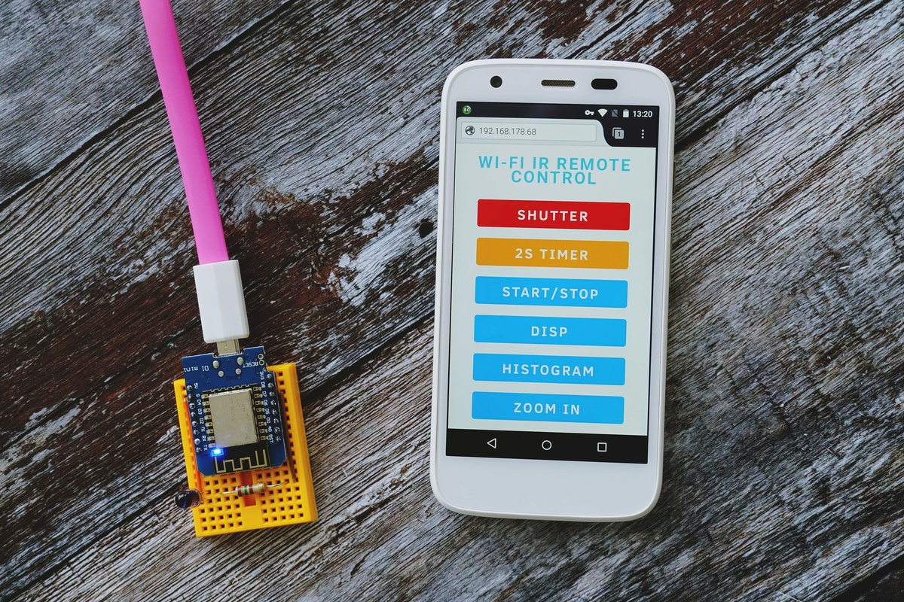
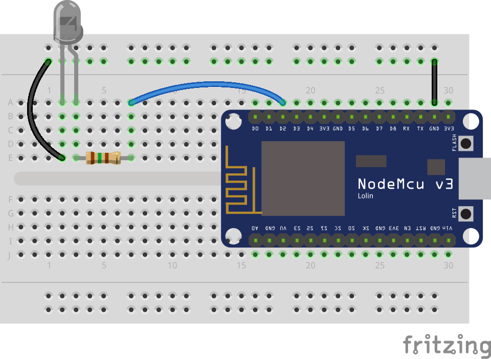

# Bimyou :cherry_blossom: 微妙

An ESP8266 NodeMCU-based remotely-controlled infrared remote control (yes, I know) for Sony cameras. It's largely based on the solution described in [https://www.youtube.com/watch?v=D40ZpVjZ744](https://www.youtube.com/watch?v=D40ZpVjZ744).

## Rationale

If you think that Bimyou is just a bad case of overengineering, you are right! However, this solution does have some redeeming qualities:

- Bimyou doesn't require any proprietary apps installed on your camera or mobile device
- You can use any device with a browser to control the camera
- It is possible to adapt Bimyou for use with camera models from other manufacturers

## Bill of Materials

- ESP 8266 NodeMCU board
- Breadboard
- 1x 150Ohm resistor
- IR LED (940nm)
- Wires

## Schematics

Wire the parts as shown on the diagram below.

# Installation and Usage

1. Open the *bimyou.ino* sketch and specify the correct *ssid* and *password* values
2. Upload the sketch to your ESP8266 NodeMCU board
3. Enable the Remote Control feature on your Sony camera
3. Point a browser to the device's IP address
4. Use the buttons to control the camera

## Problems?

Please report bugs and issues in the [Issues](https://gitlab.com/dmpop/bimyou/issues) section.

## Contribute

If you've found a bug or have a suggestion for improvement, open an issue in the [Issues](https://gitlab.com/dmpop/bimyou/issues) section.

To add a new feature or fix issues yourself, follow the following steps.

1. Fork the project's repository repository
2. Create a feature branch using the `git checkout -b new-feature` command
3. Add your new feature or fix bugs and run the `git commit -am 'Add a new feature'` command to commit changes
4. Push changes using the `git push origin new-feature` command
5. Submit a merge request

## Author

Dmitri Popov [dmpop@linux.com](mailto:dmpop@linux.com)

## License

The [GNU General Public License version 3](http://www.gnu.org/licenses/gpl-3.0.en.html)

<noscript></noscript>
